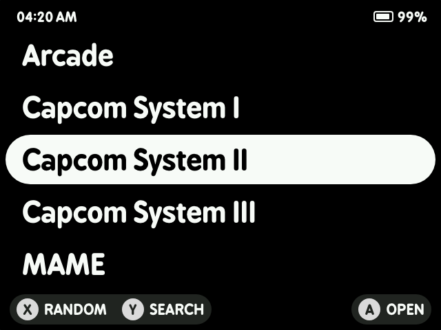
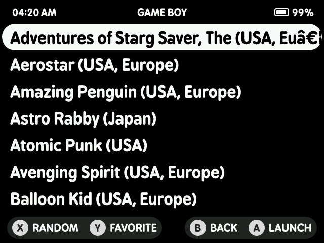
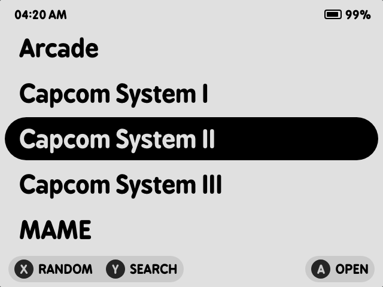
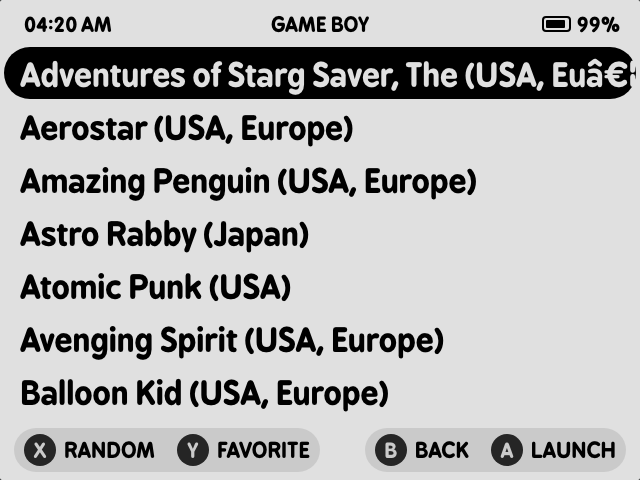
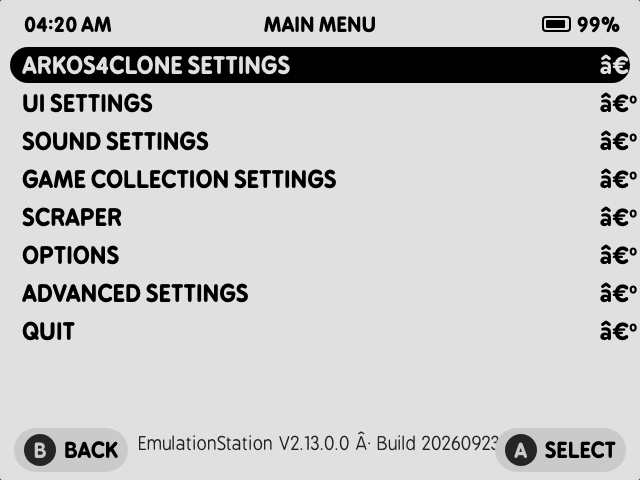
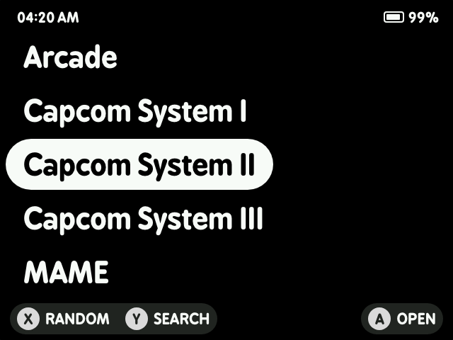
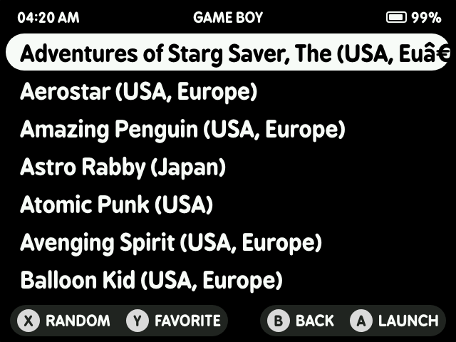
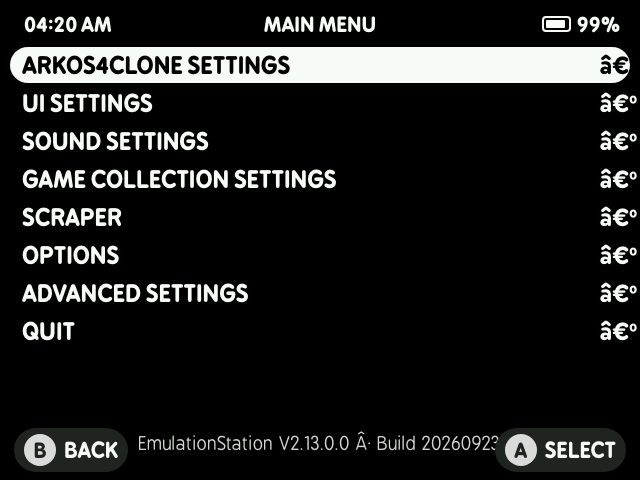
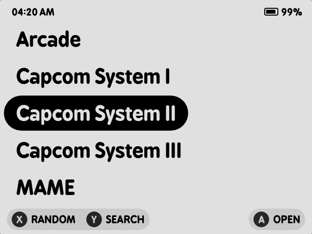
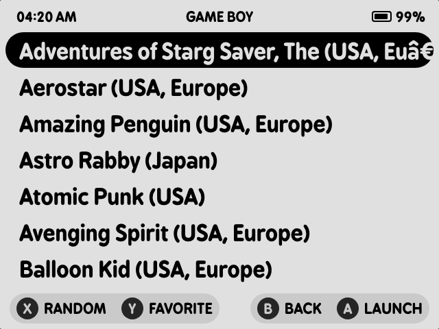

# Customizing Mono themes

Everything here works on a stock R36S running ArkOS with this build installed.
There are three levels, and most people never need to go past the first:

| Level | What you change | Where you do it | Needs a computer? |
|---|---|---|---|
| **1. Theme Configuration** | accent colour, font size | on the device, in the ES menu | no |
| **2. Drop-in files** | fonts, icons, button art, backgrounds | the theme folder on the card | a card reader or SSH |
| **3. `theme.xml`** | anything — layout, colours, geometry | [Mono Theme Studio](https://scribbbler.github.io/Mono-Theme-Studio/) or a text editor | yes |

---

## The four themes

Each ships the same structure, so anything below applies to all of them.

| | Carousel | Gamelist | Menu |
|---|---|---|---|
| **Mono Dark** |  |  |  |
| **Mono Light** |  |  |  |
| **Mono Fit Dark** |  |  |  |
| **Mono Fit Light** |  |  |  |

The **Fit** pair differs in one way: the selection capsule hugs the selected
name instead of spanning the screen, and the carousel scrolls like a gamelist —
the highlight walks down the visible rows before the list moves.

*(Rendered at the device's real 640×480 from the theme files themselves.)*

---

## Level 1 — On the device, no computer

**Menu → UI Settings → Theme Configuration.** Every Mono theme offers two
settings there:

| Setting | Options | What it changes |
|---|---|---|
| **Theme Color** | White *(default)*, Amber, Cyan, Green, Pink | the accent: selected text, hint labels and icons, menu highlights. The background stays black (or white on the Light themes). |
| **Font Size** | Medium *(default)*, Small, Large, Extra Large | carousel names, game names and menu rows together, keeping the row spacing in proportion. |

Pick a theme itself under **UI Settings → Theme**. Changing either setting
redraws immediately; no restart.

One more knob worth knowing, in **UI Settings**: **On-Screen Help** turns the
button-hint bar along the bottom off entirely. The themes look noticeably
cleaner without it if you already know the buttons.

### Swapping the UI font

**Options → Tools → Apply Theme Font** replaces the system font ArkOS uses in
menus with BPreplay, so ES's own dialogs match the theme. **Restore Stock Font**
puts it back.

---

## Level 2 — Drop-in files on the card

Themes live in `/roms/themes/<theme name>/` on the ROMS partition. Get at them
by putting the card in a computer, or over SSH (`ssh ark@<device-ip>` — ArkOS's
default password is `ark` unless you changed it).

**Replace a file, keep the name, and the theme picks it up.** Nothing else to
edit. Restart EmulationStation afterwards (**Options → Restart EmulationStation**).

### Fonts

| File | Used for |
|---|---|
| `fonts/BPreplay-Bold.otf` | carousel system names, game names, menu rows |
| `fonts/BPreplay-Regular.otf` | secondary text |
| `fonts/BPreplay-Bold-Clock.otf` | the clock and battery percentage in the status bar |

Drop in any `.ttf` or `.otf` under the same filename. The clock font is a
separate file on purpose — it's a variant with tabular figures so the clock
doesn't jitter as the digits change. If you replace it with a proportional face,
expect the time to shuffle sideways every minute.

To use a font under its *own* name instead of overwriting, you have to point
`theme.xml` at it — that's Level 3, and the Studio does it for you.

### Art

All of it is replaceable. Sizes are what the theme draws them at on a 640×480
screen; SVG scales cleanly, PNG should be supplied at least at that size.

| Path | What it is |
|---|---|
| `art/battery/battery-*.svg` | the battery icon, one file per 5% step, plus `battery-charging.svg` |
| `art/buttons/*.png` | the A / B / X / Y / L / R / Start / Select and d-pad glyphs in the hint bar |
| `art/icons/arrow.svg` | the menu's right-hand chevron |
| `art/icons/battery.svg` | battery icon on the screensaver clock |
| `art/icons/lock.svg` | the padlock shown while input is locked |
| `art/icons/star.svg` | the favourite marker |
| `art/icons/volume.svg`, `brightness.svg` | the volume and brightness pop-ups |
| `art/keyboard/*.svg` | backspace, enter, shift, alt on the search keyboard — plus `shift-active.png` for shift held down |
| `art/system.png`, `gamelist.png`, `menu.png` | the flat background behind each screen |
| `art/textInput/*.png` | the search field, idle and focused |

Art is **tinted by the theme**, not used at its own colour — the engine
multiplies each icon through its alpha. Supply white shapes on transparency and
they take the accent colour; supply a coloured icon and it comes out muddied.

### Backgrounds

`art/system.png`, `art/gamelist.png` and `art/menu.png` are plain 640×480
fills. Replace one with a photograph or a pattern and it becomes a wallpaper —
but check contrast, because the text colour won't move with it.

### A sound

`audio/move.wav` plays as the selection moves. Replace or delete it.

---

## Level 3 — The theme file

### The easy way: Mono Theme Studio

**<https://scribbbler.github.io/Mono-Theme-Studio/>** — a browser tool, nothing
to install, works on a phone.

1. **Start from something.** Pick one of the Mono themes as a preset, or use
   **Import folder** / **Import .zip** to open a theme you already have — it
   reads the colours, fonts, sizes and artwork back out and fills in the
   controls.
2. **Set the engine.** The header switch chooses **Stock ES** or **This build**.
   On *This build* you get the selection capsules, gradients, keyboard styling
   and screensaver clock. On *Stock ES* those controls grey out and the exported
   file contains nothing a stock device would ignore — useful if you want the
   theme to work on an R36S that hasn't installed this build.
3. **Edit.** Colour and opacity per layer, a font per text layer, pill geometry,
   swappable art, a full-screen overlay PNG. The preview is the real 640×480
   screen in the real fonts, inside a device mock-up whose buttons work — press
   A to open a gamelist, Start for the menu, Y for the keyboard.
4. **Download .zip.** You get a complete theme folder: the `theme.xml` plus
   every font and image in use.
5. **Install it.** Unzip into `/roms/themes/`, then **UI Settings → Theme**.

### The manual way

`theme.xml` is plain XML and the Mono themes are commented throughout. Two
conventions will trip you up if nobody tells you:

**Positions and sizes are fractions of the screen, not pixels.** `0.5 0.5` is
the middle. A 48px-tall row on a 480px screen is `0.1`.

**Font sizes are divided by 1.31.** The engine multiplies every themed font size
by 1.31 before using it (`es-core/src/resources/Font.cpp`), so a name you want
at 41px is written as `0.0652` — that's 41 ÷ 1.31 ÷ 480. The Studio does this
arithmetic for you and prints the pixel value in a comment beside each size.

**Colours are `RRGGBB` or `RRGGBBAA`.** The alpha byte is honoured everywhere,
which is how per-layer opacity works — `FFFFFF80` is half-transparent white.

Everything this build adds on top of stock EmulationStation — the selection
pills, gradients, battery indicator, keyboard, screensaver clock, hint bar
styling, pop-ups — is listed with every property and its default in
**[THEME-EXTENSIONS.md](THEME-EXTENSIONS.md)**.

### Adding your own Theme Configuration options

The colour and font-size choices in Level 1 are just small XML files. Look at
`settings/color-amber.xml` — it overrides a handful of colours and nothing else
— and at the `<subset>` block near the bottom of `theme.xml` that lists them:

```xml
<subset name="color-scheme" displayName="Theme Color">
    <include name="white" displayName="White"/>
    <include name="amber" displayName="Amber">./settings/color-amber.xml</include>
</subset>
```

The first entry has no file: it's the theme's own defaults. Add a file, add a
line, and your option appears in **Theme Configuration** on the device.

---

## Troubleshooting

**The theme doesn't appear in the list.** It has to be a folder directly inside
`/roms/themes/` containing `theme.xml` — not a folder containing a folder. macOS
zips often add an extra layer, and `__MACOSX` folders alongside it are harmless
but a sign the nesting went wrong.

**Changes don't show up.** ES reads themes at startup. **Options → Restart
EmulationStation**. Theme Configuration changes are the exception — those apply
at once.

**A font or icon didn't take.** The filename has to match exactly, case
included. `BPreplay-Bold.otf` is not `bpreplay-bold.otf`.

**Keyboard keys are hard to see on a Light theme.** Known: the key fill is
`F5F5F5` against a light background. Darken `<keyColor>` in the `<keyboard>`
block — around `D0D0D0` reads well on the `E0E0E0` paper.

**Everything looks stock again.** The crash failsafe restores the stock binary
if the custom one fails within 15 seconds of launching. Re-run **Install Custom
ES** and check `Copy ES Log` if it keeps happening.

**Text is clipped or overlapping after editing.** Font sizes are the usual
cause — see the 1.31 note above. Preview in the Studio, which applies the same
multiplier.
